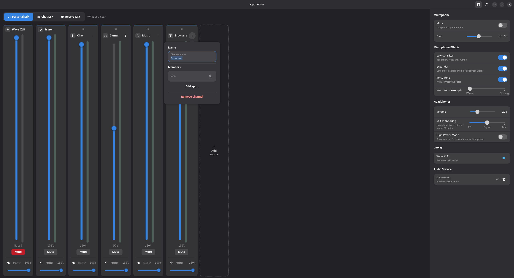

# OpenWave

Linux control application for the **Elgato Wave XLR** microphone interface. Device controls plus a Wave-Link-style submixer, built with GTK4 + Adwaita and reverse-engineered from the Elgato app.



## AI Disclosure

This code was made with the assistance of AI, currently Claude Opus 4.8. The code that I (CryoByte33) have contributed has been reviewed thoroughly and none of my contributions have been "vibed". The bulk of AI's work was parsing USB packet captures to implement various features and to do the more rote/mundane tasks that comes with development, as I have very limited time to work on personal projects.

## Features

- **Submixer** — Send any audio source to three independent mixes: Personal (what you hear), Chat, and Record. Each source has a fader per mix plus a master that scales all three, the way a GoXLR channel works.
- **Virtual mics** — The Chat and Record mixes show up as capture devices ("OpenWave Chat" and "OpenWave Record"), so Discord, OBS, and anything else can pick them like a normal microphone.
- **Source groups** — Put several apps under one channel — say, a "Games" group — so they share a single set of levels. Add or drop members, rename, or split the group from its menu. Apps are listed by their real name, not a generic PipeWire label (RuneLite shows as RuneLite, not "ALSA plug-in [java]").
- **Channel strips** — Vertical faders with live meters, mute, and drag-to-reorder; the tabs up top switch which mix you're editing.
- **Device controls** — Mic gain and mute (synced with the hardware button), headphone volume (synced with the knob), and high-power mode for low-impedance headphones. The original Wave XLR and the MK.2 are both detected automatically.
- **Voice effects and monitoring** (MK.2) — Low-cut filter, expander, and voice tune, plus a self-monitoring blend between your mic and PC audio in the headphones — the same hardware DSP Wave Link drives.
- **Capture fix** — A background service (systemd or runit) keeps the mic stream alive to dodge a firmware race that otherwise drops capture to silence.
- **System tray** — Stays out of the way in the tray; mute from its menu.
- **First-run setup** — Handles USB permissions and the audio service for you.

## How it works

### USB control

The original Wave XLR (`0fd9:007d`) is a USB Audio Class 1 device and takes its settings over vendor control transfers on endpoint 0. On Linux `snd-usb-audio` normally blocks these, because `wIndex=0x3300` routes through interface 0, which the audio driver owns. OpenWave sends `wIndex=0x3303` instead: the firmware only checks the `0x33` prefix, while the kernel sees interface 3 (unclaimed) and lets the transfer through. No driver detach, no interrupted audio.

The MK.2 (`0fd9:00b6`) is a USB Audio Class 2 device with a different control scheme — standard class requests with `wIndex=0x0203` — so it gets its own backend. Gain, mute, the voice effects, and the self-monitoring blend live in vendor setting blocks reverse-engineered from a Wave Link USB capture, which OpenWave reads and writes directly. The app checks which one is plugged in and loads the matching one.

### Mixing

Each app's audio is moved onto its own PipeWire null sink, and a small `pw-loopback` carries that sink's monitor into each mix at the fader's volume. Pulling a fader down drops that source out of the mix rather than ducking everything. The Chat and Record mixes are null sinks too, with their monitors published as capture devices so other apps can record them. The mic is read straight from the hardware, and Personal feeds your headphones.

## Install

One-liner — detects Arch, Debian/Ubuntu, Fedora, openSUSE, or Void; installs deps and OpenWave:

```bash
curl -fsSL https://raw.githubusercontent.com/rikkichy/openwave/main/install.sh | sh
```

Or from a checkout:

```bash
git clone https://github.com/rikkichy/openwave.git
cd openwave
./install.sh                  # default PREFIX=/usr/local
PREFIX=/usr ./install.sh      # for packaging-style layout
```

Uninstall:

```bash
sudo make -C /path/to/openwave uninstall PREFIX=/usr/local
```

### Upgrading from a `wavexlr` install

Earlier releases shipped as the `wavexlr` Python package, with a matching `python3 -m wavexlr` entry point and a `wavexlr-audio` runit service. All of that is now named `openwave`. To move an existing install over:

1. Reinstall from the updated source (`./install.sh`, or `sudo make install`). This adds the `openwave` package and rewrites the launcher.
2. Re-run setup under the new name: in OpenWave's device pane, uninstall Capture Fix, then restart the app. It reinstalls the audio service and the USB rule pointing at `openwave`, and clears the old `99-wavexlr.rules` in the process.
3. Delete the leftover `wavexlr` package, which the reinstall leaves sitting next to the new one in your Python site-packages:

   ```bash
   sudo rm -rf "$(python3 -c 'import site; print(site.getsitepackages()[0])')/wavexlr"
   ```

4. On runit only, remove the old service once `openwave-audio` is up:

   ```bash
   sudo sv down wavexlr-audio
   sudo rm -f /var/service/wavexlr-audio
   sudo rm -rf /etc/sv/wavexlr-audio /var/log/wavexlr-audio
   ```

### Requirements

- Python 3.10+
- GTK4, libadwaita
- PipeWire (for the mixer and the capture fix)
- libusb 1.0
- python-xlib (resolves friendly app names like "RuneLite" from window titles; the raw PipeWire name is used without it)

## Usage

```bash
openwave             # if installed via install.sh / PKGBUILD
python3 -m openwave  # from a checkout, no install needed
```

On first launch, OpenWave will prompt to set up USB permissions (via polkit) and install the audio service.

### Init systems

OpenWave detects your init system at runtime:

- **systemd** — the GUI installs a user unit at `~/.config/systemd/user/openwave.service` and enables it. No root needed for install or status checks.
- **runit** (Artix, Void, Devuan-runit) — the GUI cannot install the system service itself (writing to `/etc/sv` requires root). Create an `openwave-audio` service directory at `/etc/sv/openwave-audio/` whose `run` script execs `python3 -m openwave.daemon` as your user (typically via `chpst -u`), then enable it with `ln -s /etc/sv/openwave-audio /var/service/`.

  Status detection from the non-root GUI uses `sv check`; on stock Void the supervise FIFO is mode 0700, so OpenWave falls back to scanning `/proc` for the daemon process.

- **other** (macOS, Windows, no init detected) — the capture-fix section is disabled.

### Start hidden in tray
```bash
python3 -m openwave -- --hide
```

### Desktop entry
Copy `openwave.desktop` to `~/.local/share/applications/` for app launcher integration.

## Architecture

```
openwave/
  device.py            — USB backends for MK.1 and MK.2 (raw libusb via ctypes)
  devicecontroller.py  — device connect/poll/reconnect/writes, GTK-free and tested
  mixer.py             — submix engine: per-source sinks, loopbacks, capture devices
  mixercontroller.py   — live mixer writes, stream poll, and metering, GTK-free
  routing.py           — pure routing: sources + levels in, a plan the mixer diffs out
  sources.py           — user channels, groups, and the stream→source match
  pipewire.py          — one adapter over pw-loopback / pw-cli / wpctl
  wmnames.py           — friendly app names from the X11 window manager
  scheduler.py         — timer/thread seam plus the live-slider throttle
  meter.py             — per-source level meters off the PipeWire monitors
  mixmatrix.py         — the channel-strip mixer widget
  app.py               — GTK4/Adwaita window; wires the widgets to the controllers
  audio.py, daemon.py  — the capture keepalive and its service entry point
  setup.py, service.py — first-run setup and init-system detection
  tray.py              — StatusNotifierItem tray icon over D-Bus
```

## Credits

USB protocol reverse-engineered from the macOS Wave Link application using Frida. Inspired by [GoXLR-on-Linux/goxlr-utility](https://github.com/GoXLR-on-Linux/goxlr-utility).

## License

MIT
